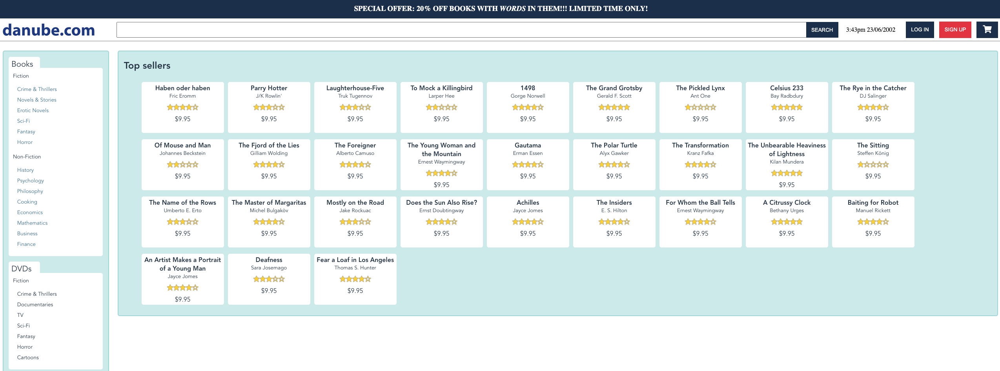
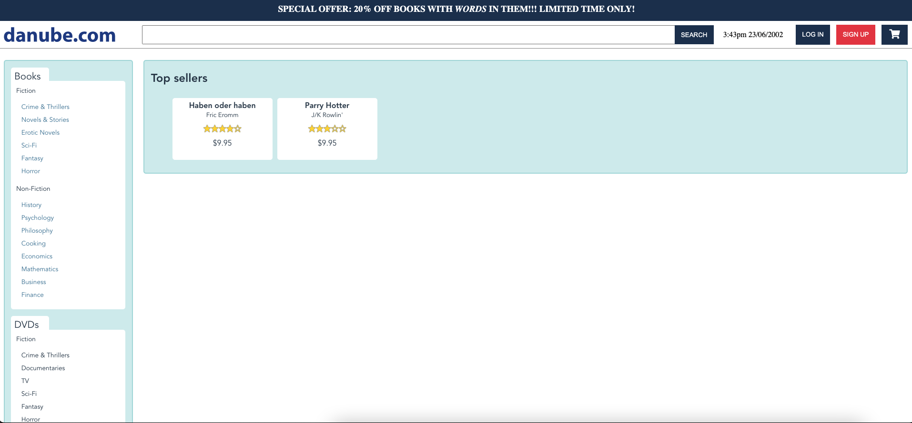
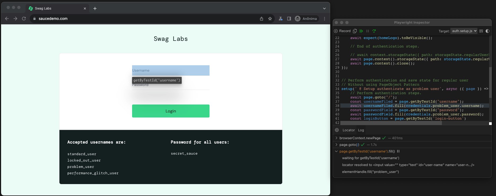
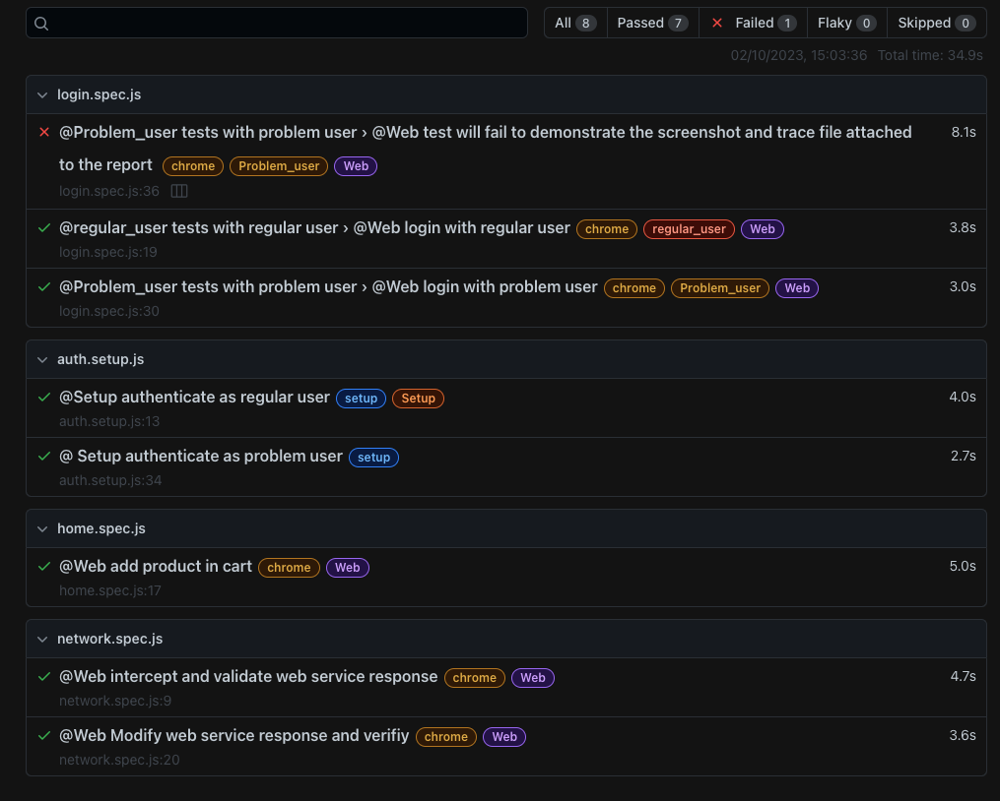

# Playwright JavaScript demo tests

In this project I demonstrate some features of Playwright framework with JavScript, for automation E2E and API tests.

This project includes:

- Frameworks:
    - Playwright


- Features:
    - Tests in multiple browser
    - Api testing (In progress)
    - Authenticated test sessions with signed states
    - Test setup
    - PageObject Pattern
    - Intercepting page requests (Network Events)
    - Mock page requests
    - Screenshot on fail and attach to report
    - Generate trace file on fail and attach to report
    - Using trace file for debug failed test
    - Debug tests with interactive Playwright Inspector
    
## Demo Pages
For these tests I use a Sauce Labs demo app which can be found here: [Sauce Demo](https://www.saucedemo.com/)
And a demo shop site named as the Danube, with can be found here: [Danube Shop](https://danube-web.shop/)

## Requirements
- Node >= 16.0 - [How install Node](https://nodejs.org/en)
- NVM (Optional) [How install NVM](https://github.com/nvm-sh/nvm#installing-and-updating)

## Getting Started
Create a virtual environment (optional):

```bash
$ nvm install node 16
$ nvm use 16
```

Install dependencies:

```bash
$ npm install
```

## Configure Playwright:
```bash
$ npx playwright install
```

## To run tests in Chrome, firefox or safari
```bash
$ npm run chrome
```

## To run tests in Firefox:
```bash
$ npm run firefox
```

## To run tests in Safari:
```bash
$ npm run safari
```

## To run with playwright params
```bash
$ npx playwright test --project=chrome --<parameter>
```

## Tests with multiple browser instances (contexts) and multiple pages
With playwright all tests is isolated with contexts and pages, in this project all the browser contexts are setup in auth.setup.js, ho do login and  save storage state files for cresting authenticate browser instances.

> If login fails, the test suite is aborted

```js
//tests/auth.setup.js

setup(' @Setup authenticate as regular user', async ({ page }) => {
    // Perform authentication steps.
    const poManager = new POManager(page);
    const loginPage = poManager.getLoginPage();
    await loginPage.doLogin(credentials.regular_user.username, credentials.regular_user.password)

    // Assert if login is correct
    const homePage = poManager.getHomePage();
    const homeLogo = homePage.homeLogo;
    await expect(homeLogo).toBeVisible();

    // End of authentication steps.

    // await context.storageState({ path: storageState.regularUserFile });
    await page.context().storageState({ path: storageState.regularUserFile });
    await page.context().close();
});
```

## Dependency setup
For configure test suit to rum auth.setup before all tests and for crate storage states file, the auth.setup is configured in playwright conf file as dependence of all project.

```js
projects: [
    {
      name: 'setup', // <-----
      testMatch: '**/*.setup.js',
    },
    {
      name: 'chrome',
      dependencies: ['setup'], // <-----
      use: {
        browserName: 'chromium',
        headless: false,
        screenshot: 'only-on-failure',
        video: 'off', //retain-on-failure
        ignoreHttpsErrors: true,
        permissions: ['geolocation'],
        trace: 'retain-on-failure',//off,on
        // ...devices['']
        //   viewport : {width:720,height:720}
      }

    },...
```

## Using storage state files and creating authenticated context in tests

If setup runs with no problems is possible use storage state files to create authenticate context, for this just add the fowling code in test script, for example logged as regular user:

```js
// tests/login.spec.js

test.use({ storageState: regularUserFile })
```
## Intercepting page requests (Network Events)
Playwright provides APIs to monitor and modify network traffic, both HTTP and HTTPS. Any requests that a page does, 
including XHRs and fetch requests, can be tracked, modified and handled.

In the example below I demonstrate a test that intercepts the http request from the api, collects the titles of the 
books and verifies if there is any book with the title Haben oder haben


```js
// tests/network.spec.js

test(' @Web intercept and validate web service response', async ({ page }) => {
    const responsePromise = page.waitForResponse('**/api/books');
    await page.goto("https://danube-web.shop/");
    const response = await responsePromise;
    let responseBody = await response.json();
    console.log(responseBody[0].title);
    expect(responseBody[0].title).toEqual('Haben oder haben')

})
```

## Mocking responses

- Another feature with network event is a possibility to intercept http request and modify response (Mock) that change the web service function and modify front-end.

```js
// tests/network.spec.js

test(' @Web Modify web service response and verifiy', async ({ page }) => {
    const requestBody = [
        {
            "id": 1,
            "title": "Haben oder haben",
            "author": "Fric Eromm",
            "genre": "philosophy",
            "price": "9.95",
            "rating": "★★★★☆",
            "stock": "1"
        },
        {
            "id": 2,
            "title": "Parry Hotter",
            "author": "J/K Rowlin'",
            "genre": "erotic",
            "price": "9.95",
            "rating": "★★★☆☆",
            "stock": "1"
        }
    ]
    await page.route('**/api/books', route => {
        route.fulfill({
            content_type: 'application/json',
            status: 200,
            contentType: 'text/plain',
            body: JSON.stringify(requestBody)
        });
    });

    await page.goto("https://danube-web.shop/");
    const productContainer = page.locator('.shop-content');
    const productsName = await productContainer.textContent();
    expect(productsName).toContain('Haben oder haben Fric Eromm', 'Hotter J/K Rowlin');

})
```
- Before api mock:



- After api mock:



## Interactive Debug

For debugging using playwright interactive debug run:

```bash
$ npm run debug
```


## Trace viewer
If any test fail, the trace file is attach in the report, for see and debug with the trace just click on file in report:


## Report

After runing tests is possible see report, for this run:

```bash
$ npm run open report
```

